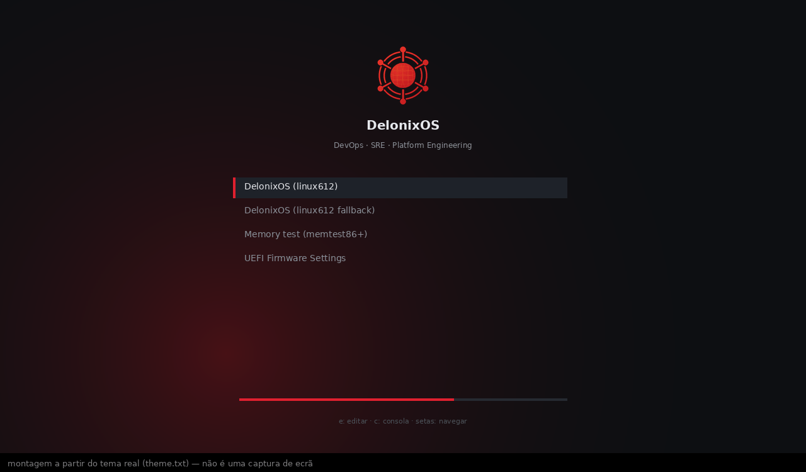
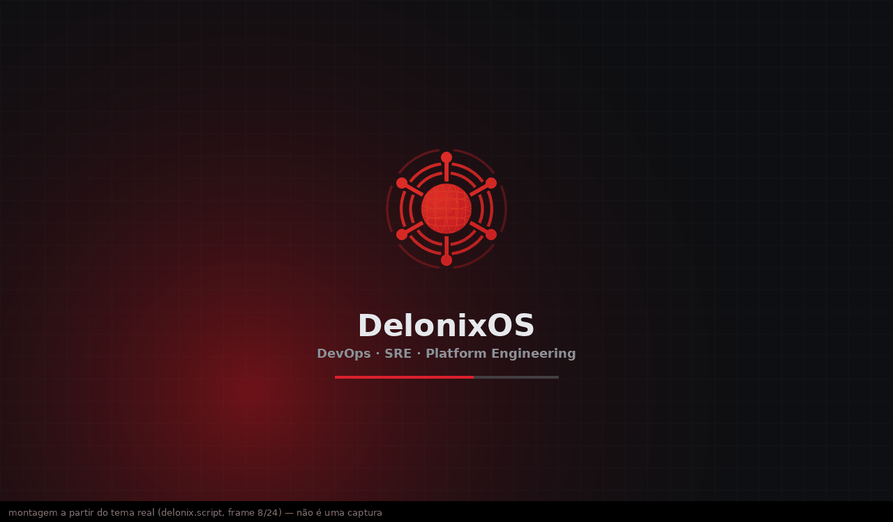
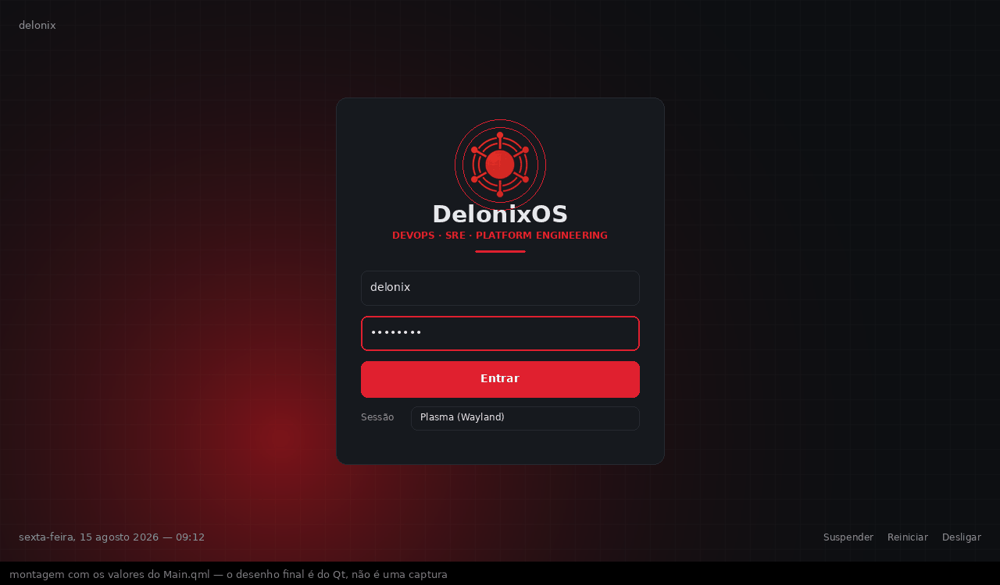
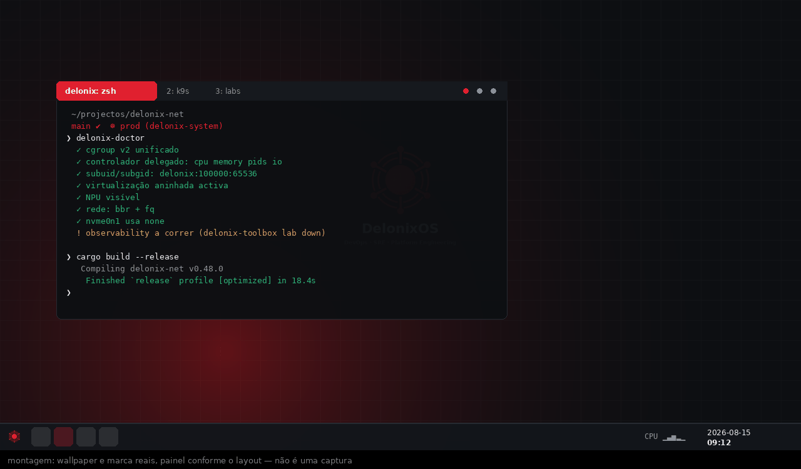
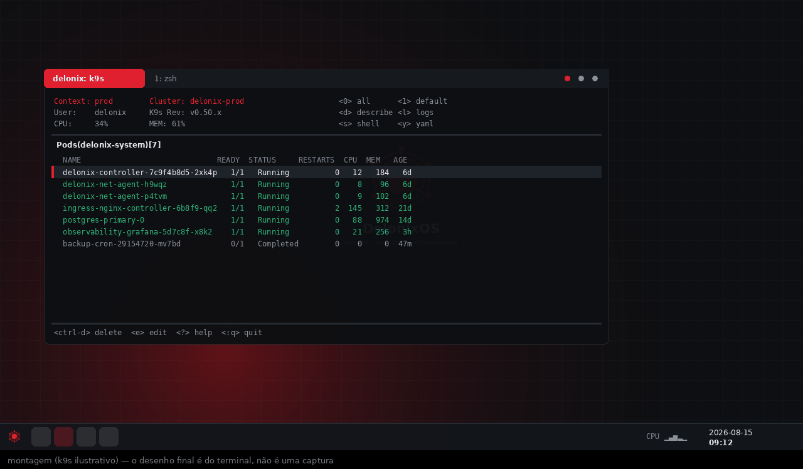
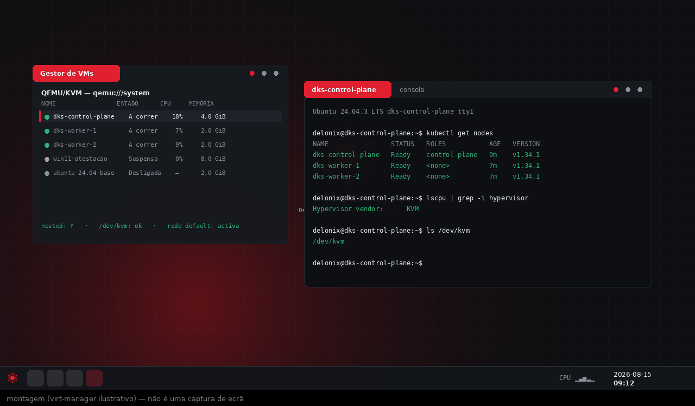
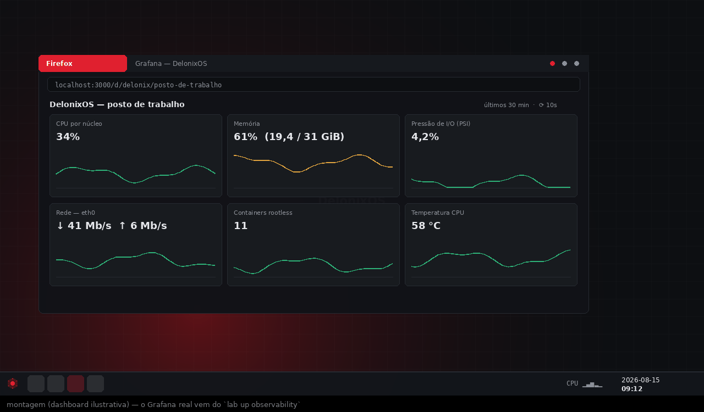
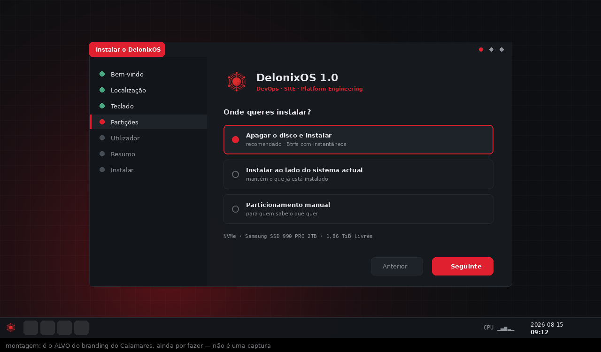

# DelonixOS

**A Linux distribution for the people who run platforms.**
DevOps · SRE · Platform Engineering — built on Manjaro KDE Plasma.

🇬🇧 English · 🇦🇴 [Português de Angola](README.pt-AO.md)

---

The goal is not the smallest image. It is **open the laptop and work**: no
toolchains to install, no kernel to tune, no afternoon spent discovering why
`cargo build` spends longer linking than compiling.

```
Manjaro (Arch) ──► rolling, stable base · pacman + AUR
      +
Plasma 6, no fat ──► no PIM, no office, no games, no file indexing,
                     no animations (reversible with one command)
      +
platform kit ──► k8s, IaC, networking, secrets, rootless containers,
                 KVM/libvirt/cloud-hypervisor, AWS+GCP, Claude Code
      +
dev environment ──► Rust, Go, Python, Node — configured, not just installed
                    PostgreSQL, Redis, MongoDB · Firefox/Chrome/Edge
      +
tuned at the factory ──► RAM (zram), CPU (tuned), GPU/NPU, I/O (udev),
                        network (BBR+fq), cgroups, limits
      +
Delonix identity ──► GRUB, animated Plymouth, SDDM, KSplash, theme, wallpapers
```

📖 **[Full tool list, grouped by profile](docs/en/tools-by-profile.md)** — what a
DevOps, an SRE and a Platform Engineer each get out of the box.

---

## Build it from your own distro

You do not need Manjaro to build DelonixOS — or to build **your own** distro
from it:

```bash
curl -fsSL https://raw.githubusercontent.com/angolardevops/delonix-os/main/install.sh | sh

delonixos doctor                     # can this machine build? exact commands for your package manager
delonixos distros                    # what is supported, and what each default resolves to
delonixos build --from ubuntu        # latest LTS
delonixos build --from ubuntu:22.04  # or a specific one
```

| Family | Distros | With no version |
|---|---|---|
| LTS only | Ubuntu, **Zorin**, Mint, Pop!_OS | latest LTS (24.04) |
| Latest | Fedora, Debian, RHEL, Rocky, Alma, openSUSE | newest release |
| Native build | Arch, Manjaro, EndeavourOS | no container needed |

Zorin is Ubuntu underneath — 18 on 24.04, 17 on 22.04 — and `doctor` says so.
An out-of-support release still builds, but you are told.

Or describe your own image in an inventory and build that instead:

```bash
delonixos init my-distro --distro ubuntu
cd my-distro && $EDITOR delonixos.yaml   # add packages, pin versions, drop what you do not want,
                                         # add your own binaries and overlay files
delonixos build -f delonixos.yaml
```

The inventory extends the official profile (or starts from `scratch`), and the
tool renders it into a manjaro-tools profile before building — that rendered
profile stays on disk, readable and diffable, because when a build goes wrong
that is where you look. Full reference: **[CLI documentation](docs/en/cli.md)**.

---

## What it looks like

> These are **composites built from the real assets**, not screenshots — the
> first ISO has not been built yet. Window contents (k9s, virt-manager, the
> Grafana dashboard) are illustrative: the numbers are made up, the tools and
> the layout are the ones that ship. GRUB and Plymouth are faithful (the
> positions come straight from the theme files); SDDM and the desktop use the
> values from `Main.qml` and the panel layout, but the final drawing is Qt's
> and Plasma's. Regenerate them with `make preview`.

| Boot menu | Boot splash (animated) |
|---|---|
|  |  |

| Login (SDDM) | Desktop |
|---|---|
|  |  |

| Kubernetes (`k9s`) | Local VMs (KVM/libvirt, nested) |
|---|---|
|  |  |

| Observability lab (`lab up observability`) | Installer (target) |
|---|---|
|  |  |

The installer shot is the **target**, not the current state: Calamares still
wears Manjaro's branding, and that is on the roadmap. Drawing it first is how
the layout gets decided before anyone writes QML.

Making these paid for itself immediately: rendering the GRUB theme at 720p —
the resolution a VM boots at — showed the menu overlapping the tagline. The
positions mixed percentages with fixed pixels, which only lines up at the
resolution they were measured on. Now everything is a percentage.

---

## Why another distro

Every engineer who operates infrastructure repeats the same setup on a fresh
machine: install the toolchains, raise the kernel limits that break
`kubectl logs -f`, and eventually discover that rootless containers silently
ignore resource limits because cgroups were never delegated. DelonixOS does that
work once, in the open, with the reason for every decision written down.

Three things it refuses to do:

- **No root daemon for containers.** The house engine (Delonix Runtime) and
  Podman are rootless. The `docker` CLI is installed and talks to the rootless
  Podman socket, so your muscle memory keeps working — but `dockerd` stays off
  unless you turn it on deliberately.
- **No decoration you pay for.** Desktop animations, blur and file indexing cost
  GPU, memory and latency. They are off by default and come back with
  `delonix-toolbox eyecandy on`.
- **No tuning left to you.** I/O scheduler per disk type, BBR with `fq`, inotify
  limits, zram, cgroup delegation, GPU/NPU drivers — all applied before you
  first log in.

---

## Tuning that comes done

This is what separates a distro with nice packages from one that works:

- **cgroup v2 delegated** to the user session (`Delegate=cpu cpuset io memory pids`).
  Without it, rootless containers silently ignore resource limits.
- **subuid/subgid** guaranteed on first boot. Without them, rootless dies with
  `newuidmap: uid range not allowed`.
- **inotify** raised to 1M watches. The kernel default breaks with three
  `kubectl logs -f` and an IDE open.
- **`vm.max_map_count`**, **`nofile=1M`**, **zram with zstd**, **earlyoom** — so a
  growing local cluster does not cost you the session.
- **Real labs**: nested KVM (a hypervisor inside a VM), wider neighbour and
  conntrack tables (dozens of VMs plus hundreds of containers on one bridge stop
  producing *neighbour table overflow*), `fs.aio-max-nr` for QEMU I/O, and the
  `tuned` **delonix-lab** profile active from first boot.
- **I/O per disk type** (udev rules): NVMe with no scheduler (the device reorders
  better and burns less CPU), SSD on `mq-deadline`, spinning disk on `bfq` —
  which is what keeps the desktop usable while a 40 GB VM image copies.
- **Network**: BBR **with the `fq` qdisc** (without it BBR loses the pacing that
  makes it worth having) and raised TCP buffers.
- **GPU/NPU**: OpenCL and Level Zero on Intel, VA-API so video decodes on the GPU
  instead of the CPU, and the **NPU driver** for Core Ultra.
- **Not freezing under load** — what separates a machine you work on from one you
  wait for: resource accounting enabled in systemd (without it no limit has any
  effect), `user.slice` prioritised over the system, `systemd-oomd` deciding by
  **pressure (PSI)** rather than free RAM, `ananicy-cpp` rules that lower
  compilers and raise the compositor, and `MAKEFLAGS`/`CARGO_BUILD_JOBS` leaving
  two cores free by default. For everything else, `delonix-carga cargo build`
  puts the work in a weight-limited cgroup — the build gets a few percent slower
  and you keep working.
- **Angola by default**: a `pt_AO` locale (Kwanza, +244, Angola) generated on
  first boot, falling back to `pt_PT` if it fails — never a locale that does not
  exist. Translations come from pt_PT, which is what exists translated.

`delonix-doctor` checks all of it and exits non-zero if something is missing.

---

## Quick start

```bash
delonix-doctor                                  # is this machine actually ready?
delonix-toolbox list                            # optional profiles
delonix-toolbox db start postgres redis mongo   # databases ship installed but stopped
delonix-toolbox eyecandy on                     # want the animations back?
delonix-toolbox lab up observability            # Grafana+Prometheus+Loki, on the Delonix Runtime
delonix update                                  # system + Delonix Runtime, one command
```

Full reference: **[`delonix-toolbox` documentation](docs/en/delonix-toolbox.md)**.

---

## Building the ISO

`buildiso` (manjaro-tools) only runs on Arch/Manjaro and needs real root (chroot,
mount, loop, mksquashfs). `build.sh` handles that by starting a privileged
Manjaro container — you do not need Manjaro installed.

```bash
make iso
```

Requirements: `podman` (with `sudo`) or `docker`, ~35 GB free, 60–120 min.
On an Arch/Manjaro host: `sudo ./scripts/in-container-build.sh`.

Part of that time is the **local AUR repository**: Chrome, Edge, MongoDB,
`gcloud`, Claude Code and Antigravity do not exist in the repositories, and the
`pacman` used by `buildiso` does not know what the AUR is. The build compiles
them into a `[delonix-aur]` repository. If one fails to build, the ISO **still
ships** without that tool, with a warning — never an hour lost to an upstream
PKGBUILD.

When it finishes, the build prints the QEMU command for the ISO it just made:

```bash
make qemu-cmd     # print it again
make test         # or just boot it
```

## Before spending an hour on a build

Three checks, in order of cost. Each catches a different class of failure, and
all of them run before `make iso`:

```bash
make verify      # seconds  — files, blocklist, syntax, symlinks, coherence
make check       # ~10 s    — the packages really exist in Manjaro (not Arch)
make preflight   # ~2 min   — pacman resolves the whole transaction, dry
```

| Check | What it catches | What it does not |
|---|---|---|
| `verify` | a missing file, a symlink in an overlay (buildiso follows them and dies), an invented `profile.conf` key, a splash frame-count mismatch | anything about packages |
| `check` | a name that does not exist in Manjaro **stable** (≠ Arch), an AUR-only package that was not declared, declared conflicts | conflicts that only appear on resolution |
| `preflight` | what `pacman` would refuse: a real conflict, an impossible dependency, a virtual package waiting for a provider choice | runtime errors inside the chroot |

`preflight` is the most valuable of the three because it is closest to the real
build: it starts a Manjaro container, syncs the repositories and asks `pacman`
itself to resolve the full list with `-Sp`, which computes everything and
downloads nothing. That is how `KERNEL-virtualbox-guest-modules` was found not
to exist on any Manjaro kernel, after passing every other validation.

`make check` has already caught what usually breaks these projects: `khotkeys`
(gone in Plasma 6), `p7zip` (now `7zip`), `redis` (Arch moved to `valkey`), and
`tlp` declaring a conflict with `tuned` — that last one aborts the build 40
minutes in.

---

## Updates: what is a package, what is the image

A file copied into the ISO is written once and **never changes again** — whoever
installed v1.0 would keep that theme and that tuning forever. So everything that
needs to evolve ships as a pacman package:

| Package | Contains |
|---|---|
| `delonix-os-branding` | Plymouth/SDDM/GRUB/Plasma themes, wallpapers |
| `delonix-os-settings` | sysctl, limits, cgroups, KVM, initramfs, tuned |
| `delonix-os-tools` | `delonix-doctor`, `delonix-toolbox` |
| `delonix-os` | meta-package — this is what the ISO installs |

Only what gains nothing from being updated stays in the image overlay:
`/etc/skel` (read only when a user is created) and the two files owned by other
packages, `/etc/default/grub` and `/etc/plymouth/plymouthd.conf`. Claiming those
would make pacman refuse the install; instead, two **pacman hooks** re-apply our
choice whenever `grub` or `plymouth` is upgraded, without overriding anyone who
changed them on purpose.

---

## Repository layout

```
delonix-os/
├── iso-profiles/delonix/devops/     manjaro-tools profile
│   ├── profile.conf                 session, services, boot args
│   ├── Packages-Root                base system
│   ├── Packages-Desktop             minimal Plasma + the whole platform kit
│   ├── Packages-Live                live environment only (Calamares)
│   ├── Packages-Mhwd                drivers
│   ├── desktop-overlay/             /etc/skel + files owned by other packages
│   └── live-overlay/                live session only
├── packaging/                       the house packages (what gets updated)
│   ├── delonix-os-branding/         themes + pacman hooks
│   ├── delonix-os-settings/         system tuning
│   ├── delonix-os-tools/            delonix-doctor, delonix-toolbox
│   └── delonix-os/                  meta-package
├── branding/gen-assets.py           generates every brand PNG (and the animation)
├── packages/
│   ├── blocklist.txt                what stays out, and why (enforced at build)
│   └── aur.list                     what gets compiled during the build
├── scripts/                         build · verify · qemu · packaging
└── docs/                            en/ · pt-AO/
```

---

## Documentation

| English | Português de Angola |
|---|---|
| [Tools by profile](docs/en/tools-by-profile.md) | [Ferramentas por perfil](docs/pt-AO/ferramentas-por-perfil.md) |
| [`delonixos` CLI](docs/en/cli.md) | [CLI `delonixos`](docs/pt-AO/cli.md) |
| [`delonix-toolbox`](docs/en/delonix-toolbox.md) | [`delonix-toolbox`](docs/pt-AO/delonix-toolbox.md) |
| [Filesystem and disk layout](docs/en/filesystems.md) | [Sistema de ficheiros e disco](docs/pt-AO/sistemas-de-ficheiros.md) |
| [Command reference](docs/en/commands.md) | [Referência de comandos](docs/pt-AO/comandos.md) |
| [Kernel contribution](docs/en/kernel.md) | [Contribuir para o kernel](docs/pt-AO/kernel.md) |
| [Design decisions](docs/en/decisions.md) | [Decisões de desenho](docs/pt-AO/decisoes.md) |
| [Validating a build](docs/en/validation.md) | [Validar um build](docs/pt-AO/validacao.md) |
| [Roadmap](docs/en/roadmap.md) | [Roteiro](docs/pt-AO/roteiro.md) |

All `delonix-*` commands, their options and their output are in **English**, so
the distro is usable by anyone. Code comments in this repository are written in Portuguese — that is where the
reasoning lives, and it is kept in the language the work was done in.

---

## Status

Profile, overlays, branding, packaging and build tooling are complete and
validated: **392 packages** resolved against the Arch/AUR repositories, no
declared conflicts, pre-flight check green. The first ISO is being built.

Contributions are welcome — especially hardware reports (does the NPU show up?
does nested virtualization work on your CPU?) and packaging fixes.

---

## Author

**Walter Angolar** — DevOps · SRE · Platform Engineering

- LinkedIn: [walter-angolar](https://www.linkedin.com/in/walter-angolar-02a96b24/)
- GitHub: [@angolardevops](https://github.com/angolardevops)

Part of the **N'GolaCloud** platform effort.

## License

GPL-3.0-or-later. See [LICENSE](LICENSE).
